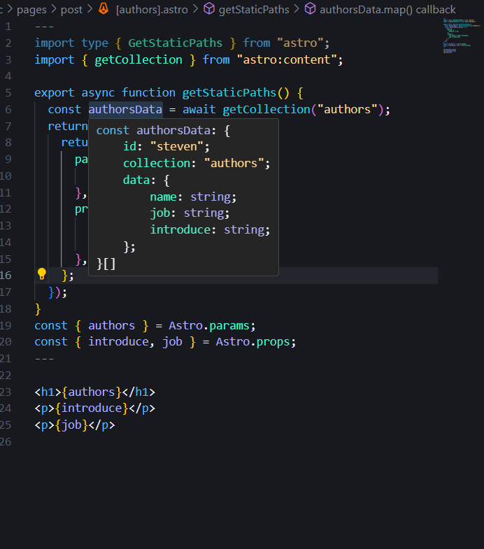

# Content 使用 file.mdx 作出動態頁面

## 說明:

在動態頁面使用async function getStaticPath()，會回傳一個物件，物件內有paths跟fallback，paths是一個陣列，陣列內的物件是動態路由的參數，fallback是一個布林值，如果為true，則會在網頁上顯示404頁面，如果為false，則會在網頁上顯示空白頁面。

在getStaticPath()裡面定義getCollection()，getCollection()是一個async function，會回傳一個物件，物件內有data跟error，data是一個陣列，陣列內的物件是從astro的collection取得的資料，error是一個布林值，如果為true，則會在網頁上顯示404頁面，如果為false，則會在網頁上顯示空白頁面。

請參考:[Astro.build](https://docs.astro.build/en/guides/content-collections/)

```js
---
import { getCollection } from "astro:content";
import BlogPost from "../../layouts/BlogPost.astro";

export async function getStaticPaths() {
  const noteData = await getCollection("note");

  return noteData.map((note) => {
    return {
      params: {
        note: note.slug,
      },
      props: {
        title: note.data.title,
        description: note.data.description,
        image: note.data.image,
        link: note.data.link,
        content: note.render(),
      },
    };
  });
}

const { title, description, image, link, content } = Astro.props;

const { Content } = await content;
---
```
## 參考圖片

