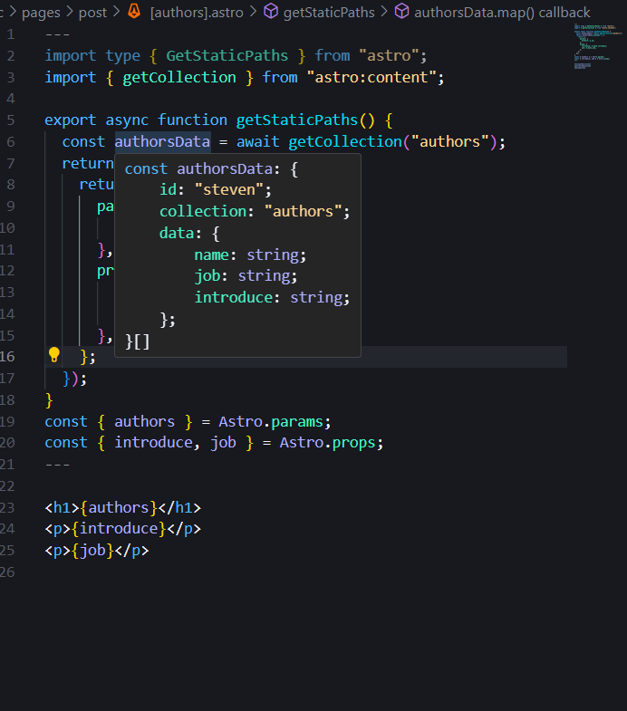

import Button from "../../../components/Button";

# Content 使用 file.mdx 作出動態頁面

## Note

在動態頁面使用async function getStaticPath()，會回傳一個物件，物件內有paths跟fallback，paths是一個陣列，陣列內的物件是動態路由的參數，fallback是一個布林值，如果為true，則會在網頁上顯示404頁面，如果為false，則會在網頁上顯示空白頁面。

在getStaticPath()裡面定義getCollection()，getCollection()是一個async function，會回傳一個物件，物件內有data跟error，data是一個陣列，陣列內的物件是從astro的collection取得的資料，error是一個布林值，如果為true，則會在網頁上顯示404頁面，如果為false，則會在網頁上顯示空白頁面。

請參考:[Astro.build](https://docs.astro.build/en/guides/content-collections/)

## 參考圖片

<a href="/">
  <Button
    variant="outlined"
    themeColor="primary"
    className="rounded-lg"
    client:load
  >
    google
  </Button>
</a>
